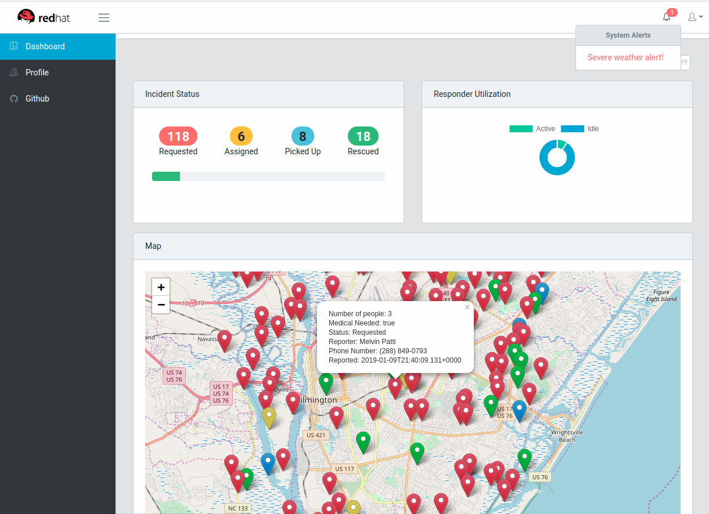

# Emergency Console

Management interface to demonstration system running as a series of microservices on [Openshift](https://www.openshift.com/). This project was generated with [Angular CLI](https://github.com/angular/angular-cli) version 7.1.1.

## Development build

Run `npm run buildDev` for a dev build with output in `dist/` that will continuously watch the source code for changes. A production, minified build is built with `npm run build`. The production build is the default build action when running on [Openshift]()

## Development Server

Run `run-local.sh` for a static Express server that will serve content from the generated `dist/` folder. It will also set environment variables to configure services that are remote. By default the server script attempts to run on port `8080` and looks for microservices labeled `incident-service, alert-service, responder-service` as a backends.

## Code scaffolding

Run `ng generate component component-name` to generate a new component. You can also use `ng generate directive|pipe|service|class|guard|interface|enum|module`.

## Build

Run `ng build` to build the project. The build artifacts will be stored in the `dist/` directory. Use the `--prod` flag for a production build.

## Running end-to-end tests

Run `ng e2e` to execute the end-to-end tests via [Protractor](http://www.protractortest.org/).

## Further help

To get more help on the Angular CLI use `ng help` or go check out the [Angular CLI README](https://github.com/angular/angular-cli/blob/master/README.md).

## API Gateway 

To every request for mission/incident and responder services a user-key header is being added to the request.
To disable it, just open environment.ts and set the **isGatewayEnabled** to false.
