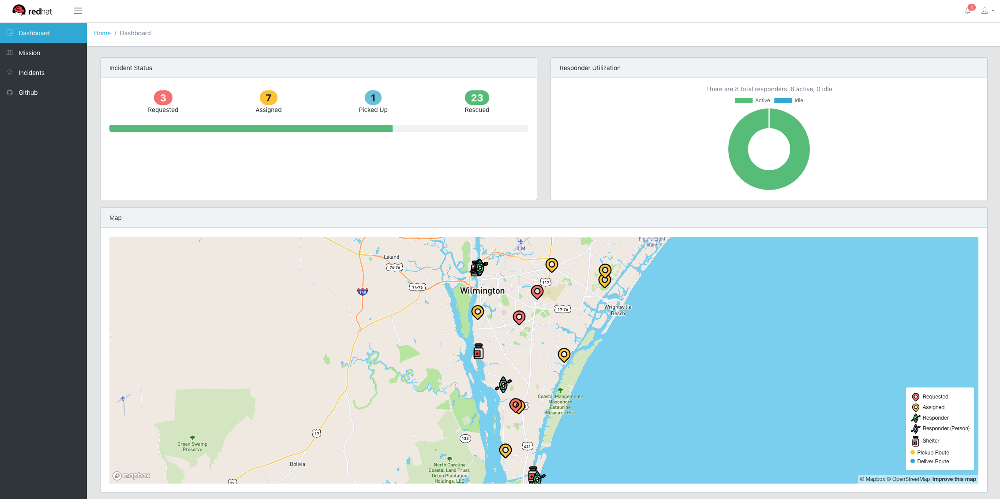
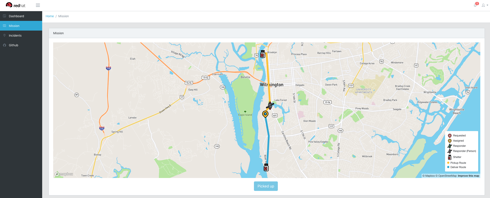
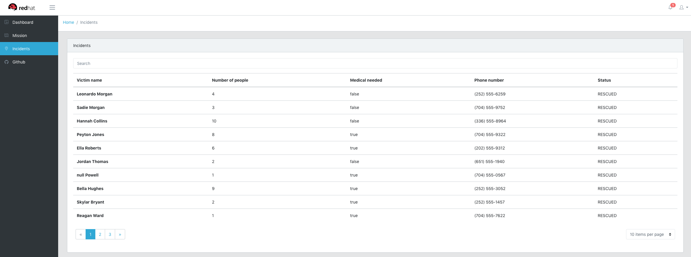

# Emergency Response - Web Console

The web interface for the emergency response demo, built using Angular 7.

## Overview

The web console has three main tabs.

### Dashboard

The dashboard tab shows an overview of the status of all incidents and
responders along with a map view of all ongoing missions. These values update
in real-time based on events in Kafka.



### Mission

The mission tab allows the user to make themselves an available responder in
the emergency response system. To do this, select a location on the provided
map to set your current location and select `Available`. The user will then be
assigned a mission. Once the user reaches the waypoint of the victim, select
the `Picked up` button to drop off the victim. Once a mission has been
completed the user will be set to an unavailable state again.



### Incidents

The incidents tab is a table of all incidents that have been created and their
information. It has a search bar that will perform searches based on all
information about the incident.



## Running locally

To run the webapp locally, the `run-local.sh` script must be updated to point
to the URLs of each of the emergency response services and a MapBox token must
be provided for the `TOKEN`.

Once `run-local.sh` has been updated, two scripts been to be executed

```
npm run buildDev
```

to watch the project and rebuild when neeeded, and

```
./run-local.sh
```

to start the development server.

The web console will be available on port `8080` by default, or the value of
`PORT` in `run-local.sh` if it is provided.
